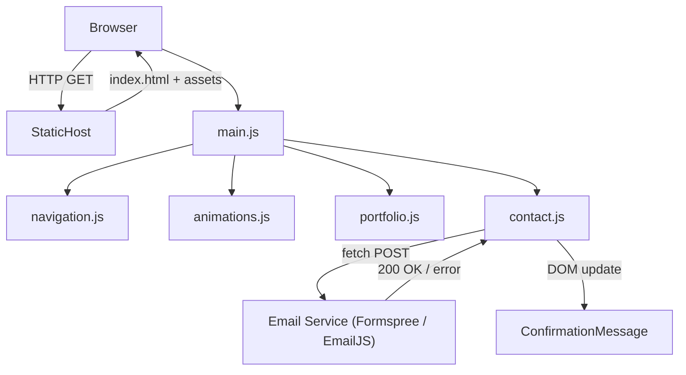

# Design Document

## Overview

The portfolio website is a single-page application (SPA) delivered as a static site with no backend requirement for the core experience. It is built with HTML5, CSS3 (custom properties + utility classes), and vanilla JavaScript — keeping the dependency footprint minimal, ensuring near-instant load times, and making deployment trivial to any static host (GitHub Pages, Netlify, Vercel, etc.).

The design language is a premium black-and-white minimalist system: near-black backgrounds paired with crisp white typography, subtle grayscale gradients for depth, and generous whitespace. Interactions are driven by CSS transitions (150–300 ms) and IntersectionObserver-powered entrance animations. The site is fully responsive across three breakpoints (mobile < 768 px, tablet 768–1023 px, desktop ≥ 1024 px) and respects the `prefers-reduced-motion` media query.

### Technology Choices

| Concern | Choice | Rationale |
|---|---|---|
| Markup | HTML5 (semantic elements) | Zero runtime overhead, SEO-friendly |
| Styling | CSS3 + CSS custom properties | No build step, easily themeable |
| Scripting | Vanilla ES2020+ | Minimal bundle, no framework overhead |
| Animations | CSS transitions + IntersectionObserver | GPU-accelerated, respects reduced-motion |
| Forms | Client-side validation + fetch (optional emailjs/formspree) | No server required |
| Testing | Jest + fast-check (PBT) | Property-based correctness for business logic |
| Hosting | Static (Netlify / GitHub Pages) | Free tier, instant CDN |

---

## Architecture

The site follows a **Modular Vanilla JS** architecture: each section is a self-contained HTML fragment, CSS module, and JS module. A thin `main.js` orchestrator imports all modules and wires up global behaviours (navigation, scroll observation, reduced-motion detection).

```
portfolio-website/
├── index.html              ← Single entry point
├── assets/
│   ├── fonts/              ← Self-hosted web fonts
│   ├── images/             ← Optimised WebP images + fallbacks
│   └── icons/              ← SVG icon sprites
├── css/
│   ├── tokens.css          ← Design tokens (colors, spacing, radius)
│   ├── base.css            ← Reset + typography baseline
│   ├── layout.css          ← Grid + flex utilities
│   ├── components.css      ← Cards, buttons, forms
│   └── animations.css      ← Keyframes + transition utilities
├── js/
│   ├── main.js             ← Orchestrator: imports + init
│   ├── navigation.js       ← Sticky nav, hamburger, smooth scroll
│   ├── animations.js       ← IntersectionObserver entrance logic
│   ├── portfolio.js        ← Portfolio grid, modal logic
│   ├── contact.js          ← Form validation + submission
│   └── utils.js            ← Shared helpers (debounce, sanitise, etc.)
└── tests/
    ├── contact.test.js     ← PBT + unit tests for form validation
    ├── navigation.test.js  ← Smooth scroll + nav logic tests
    └── portfolio.test.js   ← Portfolio filter / modal tests
```

### Data Flow



---

## Components and Interfaces

### 1. NavigationBar

**Responsibility:** Persistent sticky header; smooth-scroll links; mobile hamburger toggle.

```js
// navigation.js public interface
initNavigation(): void
  // Sets up sticky behaviour, click listeners, hamburger toggle,
  // and active-link highlighting based on scroll position.

scrollToSection(sectionId: string): void
  // Smoothly scrolls to the element with id === sectionId.

toggleMobileMenu(open?: boolean): void
  // Opens or closes the mobile overlay menu.
  // If open is omitted, the current state is toggled.
```

**Behaviour contract:**
- Sticky via `position: sticky; top: 0; z-index: 100`.
- Hamburger visible only when `viewport.width < 768`.
- On link click → call `scrollToSection(id)` + close mobile menu if open.
- Hover effect: `color` transitions in 200 ms via CSS.

---

### 2. HeroSection

**Responsibility:** Owner introduction, tagline, CTA button(s).

Purely HTML/CSS with a JS-triggered entrance animation on first paint. No runtime logic beyond the initial fade-in-slide-up (`@keyframes heroEntrance`, 800 ms max).

---

### 3. AboutSection

**Responsibility:** Owner bio, photo, skills summary.

Enters via `IntersectionObserver` fade-in/slide (≤ 600 ms). On mobile, switches from two-column (photo | text) to single-column stacked via CSS Grid `auto-fit`.

---

### 4. ServicesSection

**Responsibility:** Service card grid with staggered entrance.

```js
// No JS needed beyond IntersectionObserver triggering the CSS class.
// CSS handles stagger via nth-child animation-delay.
```

Card anatomy:
```
┌─────────────────────────────┐
│  [Icon / SVG]               │
│  Service Title              │
│  Short description text     │
└─────────────────────────────┘
  border-radius: ≥ 8px
  hover: translateY(-4px) + box-shadow elevation (200ms)
```

---

### 5. PortfolioSection

**Responsibility:** Responsive image grid; hover overlay; detail modal.

```js
// portfolio.js public interface
initPortfolio(): void
  // Attaches hover listeners and click → modal listeners.

openModal(itemId: string): void
  // Renders the PortfolioModal with data for itemId.
  // Traps keyboard focus within modal (Tab + Shift+Tab cycling).
  // ESC key closes modal.

closeModal(): void
  // Hides modal; restores focus to the triggering Portfolio_Item.
```

**Grid layout** (responsive via CSS Grid `auto-fill`):

| Viewport | Columns |
|---|---|
| < 768 px | 1 |
| 768–1023 px | 2 |
| ≥ 1024 px | 3 |

**Hover overlay** (≤ 300 ms):  
CSS `::after` pseudo-element with `opacity: 0 → 1` transition revealing title + "View" label.

---

### 6. TestimonialsSection

**Responsibility:** Client quote cards with entrance animation; mobile carousel option.

Card anatomy:
```
┌──────────────────────────────────────────┐
│  "Quote text from client…"               │
│                                          │
│  Client Name · Role / Company            │
└──────────────────────────────────────────┘
  border-radius: ≥ 8px
```

On mobile (< 768 px): single-column stack OR CSS Scroll Snap horizontal carousel.

---

### 7. ContactSection

**Responsibility:** Contact form with inline validation; owner contact info.

```js
// contact.js public interface
initContactForm(): void
  // Attaches submit listener; wires up live validation.

validateField(fieldName: string, value: string): ValidationResult
  // Returns { valid: boolean, error: string | null }
  // Pure function — no side effects.

validateForm(formData: FormData): ValidationResult[]
  // Validates all fields; returns array of per-field results.

submitForm(formData: FormData): Promise<SubmitResult>
  // Posts to email service; resolves with { success: boolean, message: string }.
```

**Validation rules (pure, testable):**

| Field | Rule |
|---|---|
| name | Required; 1–100 chars; non-whitespace-only |
| email | Required; matches RFC 5322 simplified pattern |
| subject | Required; 1–200 chars; non-whitespace-only |
| message | Required; 1–2000 chars; non-whitespace-only |

---

### 8. AnimationsModule

**Responsibility:** IntersectionObserver orchestration; reduced-motion guard.

```js
// animations.js public interface
initAnimations(): void
  // Observes all [data-animate] elements.
  // On first intersection: adds .is-visible CSS class (triggers CSS transition).
  // Once triggered, unobserves the element (no replay on scroll-up).

prefersReducedMotion(): boolean
  // Returns window.matchMedia('(prefers-reduced-motion: reduce)').matches
  // If true, initAnimations() skips observation and marks all elements visible.
```

---

## Data Models

### PortfolioItem

```ts
interface PortfolioItem {
  id: string;           // unique slug, e.g. "brand-identity-01"
  title: string;        // project title
  category: string;     // e.g. "Branding", "Web Design"
  imageSrc: string;     // path to WebP image
  imageAlt: string;     // descriptive alt text (required)
  description: string;  // full project description (shown in modal)
  tags: string[];       // optional technology/skill tags
}
```

### TestimonialCard

```ts
interface TestimonialCard {
  id: string;
  quote: string;        // client testimonial text
  clientName: string;
  clientRole: string;   // e.g. "CEO, Acme Corp"
}
```

### ServiceItem

```ts
interface ServiceItem {
  id: string;
  title: string;
  iconSvg: string;      // inline SVG string or icon ID reference
  description: string;
}
```

### FormData

```ts
interface ContactFormData {
  name: string;
  email: string;
  subject: string;
  message: string;
}
```

### ValidationResult

```ts
interface ValidationResult {
  field: string;
  valid: boolean;
  error: string | null;  // null when valid
}
```

### SubmitResult

```ts
interface SubmitResult {
  success: boolean;
  message: string;  // user-facing confirmation or error message
}
```

---

## Correctness Properties

*A property is a characteristic or behavior that should hold true across all valid executions of a system — essentially, a formal statement about what the system should do. Properties serve as the bridge between human-readable specifications and machine-verifiable correctness guarantees.*

### Property 1: Non-whitespace field validation rejects blank-equivalent inputs

*For any* string composed entirely of whitespace characters (spaces, tabs, newlines), `validateField` for any required field SHALL return `{ valid: false }`.

**Validates: Requirements 7.3, 7.4**

---

### Property 2: Valid contact form data passes all field validations

*For any* `ContactFormData` where name is a non-empty non-whitespace string (1–100 chars), email matches a valid RFC 5322 simplified pattern, subject is non-empty (1–200 chars), and message is non-empty (1–2000 chars), `validateForm` SHALL return an array where every `ValidationResult.valid === true`.

**Validates: Requirements 7.2**

---

### Property 3: Invalid email format always fails email validation

*For any* string that does not match the pattern `<local>@<domain>.<tld>` (i.e., lacks an `@` symbol, has no domain, or has no TLD), `validateField('email', value)` SHALL return `{ valid: false }`.

**Validates: Requirements 7.4**

---

### Property 4: Partial form submission always fails

*For any* `ContactFormData` where at least one required field is empty or whitespace-only, `validateForm` SHALL return at least one `ValidationResult` with `valid === false` and a non-null `error` string.

**Validates: Requirements 7.3**

---

### Property 5: Service items render required fields

*For any* `ServiceItem`, the rendered HTML for that service card SHALL contain the item's `title`, `iconSvg` reference, and `description` text.

**Validates: Requirements 4.1**

---

### Property 6: Portfolio items render required fields

*For any* `PortfolioItem`, the rendered HTML for that item SHALL contain the item's `title`, the `imageAlt` text on the `` element, and the `category` tag.

**Validates: Requirements 5.1, 9.3**

---

### Property 7: Testimonial cards render required content

*For any* `TestimonialCard`, the rendered HTML for that card SHALL contain the `quote`, `clientName`, and `clientRole` strings.

**Validates: Requirements 6.1**

---

### Property 8: Staggered animation delay is proportional to item index

*For any* set of stagger-animated elements (service cards, portfolio items), the n-th element's CSS `animation-delay` SHALL equal `n × BASE_STAGGER_MS`, ensuring each element enters after the previous one.

**Validates: Requirements 4.4, 5.4**

---

### Property 9: Animation entrance fires exactly once per element

*For any* element observed by `initAnimations`, after the element first enters the viewport the `.is-visible` class SHALL be added and the element SHALL be unobserved, ensuring the animation does not replay on subsequent scroll events.

**Validates: Requirements 10.1, 10.4**

---

### Property 10: Reduced-motion disables all entrance animations

*For any* page state where `prefersReducedMotion()` returns `true`, all `[data-animate]` elements SHALL have `.is-visible` applied immediately on init without IntersectionObserver observation, ensuring no entrance transitions are triggered.

**Validates: Requirements 10.3**

---

## Error Handling

### Form Validation Errors

- Inline, field-level error messages appear beneath the offending input on blur or submit.
- Errors are associated with inputs via `aria-describedby` pointing to the error `<span>`.
- Submitting with errors does NOT reload the page; form state is preserved.
- On successful submission, the form is hidden and a success message is shown.

### Network / Submission Errors

- If the email service returns a non-2xx response or a network error occurs, the form displays a generic error banner: "Something went wrong. Please try again or email directly at [owner email]."
- The submit button is re-enabled so the visitor can retry.
- Errors are caught in the `submitForm` promise chain; uncaught exceptions are never surfaced to the user.

### Image Load Errors

- All `` elements include a fallback via the `onerror` attribute or a CSS background placeholder.
- Alt text is always present (required by `PortfolioItem.imageAlt`).

### JavaScript Errors

- A top-level `window.addEventListener('error', ...)` handler prevents the entire page from breaking if a non-critical module fails. Navigation and static content remain functional.

### Reduced-Motion / No-JS

- All content is visible and accessible without JavaScript (progressive enhancement).
- CSS animations are suppressed via `@media (prefers-reduced-motion: reduce)` independently of JS.

---

## Testing Strategy

### Overview

The testing approach uses two complementary layers:

1. **Unit / Example-based tests** — verify specific behaviours, edge cases, and integration points.
2. **Property-based tests (PBT)** — verify universal correctness properties across randomly generated inputs using **fast-check** (a mature JS/TS PBT library).

PBT is applied exclusively to the pure-function logic layer (`validateField`, `validateForm`, render helpers). It is **not** applied to DOM manipulation, CSS transitions, IntersectionObserver behaviour, or the email service integration.

### Test Runner

- **Jest** (v29+) with `@jest/globals` for module mocking.
- **fast-check** for property-based test arbitraries.
- Each property test runs a minimum of **100 iterations**.

### Property-Based Tests

Each property test is tagged with a comment in the format:  
`// Feature: portfolio-website, Property N: <property text>`

| Property | Test file | Arbitrary | Assertion |
|---|---|---|---|
| P1: Whitespace-only inputs fail | `contact.test.js` | `fc.stringMatching(/^\s+$/)` | `validateField(f, v).valid === false` |
| P2: Valid form data passes | `contact.test.js` | Composed valid-field arbitraries | All `ValidationResult.valid === true` |
| P3: Invalid email fails | `contact.test.js` | `fc.string()` filtered to no `@` | `validateField('email', v).valid === false` |
| P4: Partial form fails | `contact.test.js` | Form with ≥1 blank field | At least one `valid === false` |
| P5: Service item renders fields | `services.test.js` | `fc.record({id, title, iconSvg, description})` | Title + icon + description in HTML |
| P6: Portfolio item renders fields | `portfolio.test.js` | `fc.record({id, title, category, imageAlt, ...})` | Title + alt + category in HTML |
| P7: Testimonial card renders content | `portfolio.test.js` | `fc.record({quote, clientName, clientRole})` | All three strings in rendered HTML |
| P8: Stagger delay proportional to index | `animations.test.js` | `fc.integer({min:0, max:20})` as index | `delay === index × BASE_STAGGER_MS` |
| P9: Animation fires exactly once | `animations.test.js` | Simulated IntersectionObserver calls | `.is-visible` added once; element unobserved |
| P10: Reduced-motion disables animations | `animations.test.js` | `prefersReducedMotion = true` | All elements immediately `.is-visible` |

### Unit / Example-Based Tests

| Area | Tests |
|---|---|
| Navigation | Hamburger toggle state machine; scroll target resolution |
| Smooth scroll | `scrollToSection` called with correct element id |
| Portfolio modal | Opens with correct data; closes on ESC; focus trapped |
| Contact submission | Success path renders confirmation; error path re-enables submit |
| Accessibility | Alt text present on all images; aria attributes on form fields |
| Responsive layout | CSS class changes at each breakpoint (JSDOM viewport mock) |

### Integration / Smoke Tests

| Area | Approach |
|---|---|
| Lighthouse CI | Automated Lighthouse run in CI pipeline; asserts score ≥ 90 for performance and accessibility |
| Cross-browser | Manual / BrowserStack smoke test on Chrome, Firefox, Safari, Edge (latest 2 versions) |
| Contact form submission | Single end-to-end test against Formspree sandbox endpoint |

### Accessibility Testing

- All interactive elements verified for keyboard focus order using Jest + `@testing-library/dom`.
- Screen reader compatibility verified via manual VoiceOver / NVDA spot-check.
- Colour contrast ratios checked with automated tooling (axe-core in Jest).
